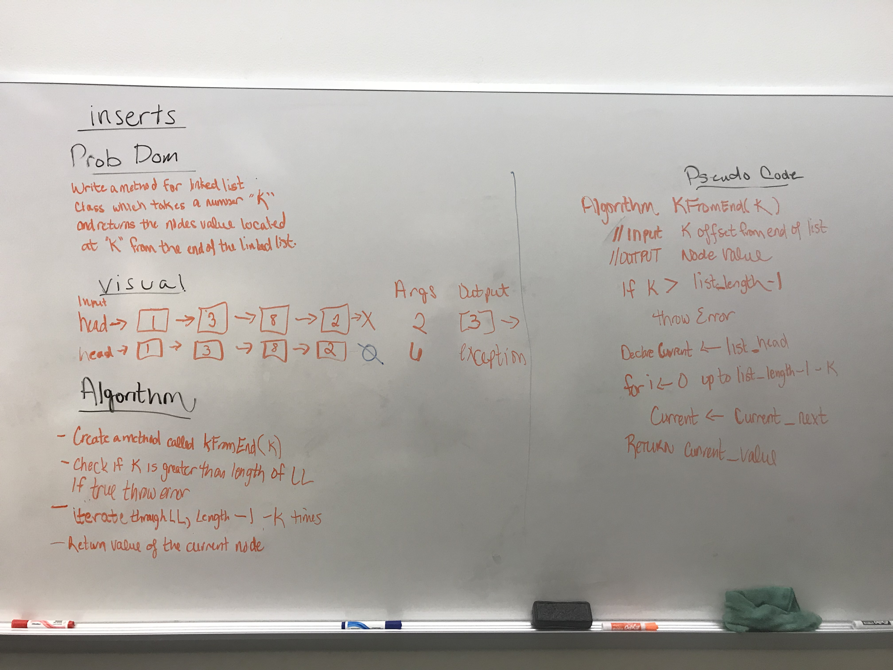

#DATA STRUCTURES
This section includes an implementation for the following data structures as well as whiteboard examples to show how they were developed. In each folder is included jest tests for when they were initially developed with TDD.
  - [Linked List](#linked-list)
  - [Queue](#queue)
  - [Stack](#stack)
  - [Binary Search Tree](#binary_search_tree)
  - [Hash Table](#hash_table)
  - [Graph](#graph)
  - [Weighted Graph](#weighted_graph)

## Linked-List

#### Features
  Features include a singularly linked-list data structure and adds the methods:
  - append( value)
  - prepend( value) 
  - insertBefore( refVal, newVal)
  - insertAfter( refVal, newVal)
  - remove( offset)
  - reverse() 
  - serialize()
  - deserialize( serializedList)
  - kFromEnd( number)
  - merge lists(listOne, listTwo)    

#### Whiteboards

## Queue 

#### Features
Features include queue data structure and adds the methods:

  - enqueue
  - dequeue
  - serialize/deserialize

## Stack

#### Features
Features include stack data structure and adds the methods:

  - push
  - pop
  - serialize/deserialize

## Binary_Search_Tree

#### Features

Features include a constructor function for a tree data structure with the following methods implementing a binary search tree:

- insert( node)
- remove( node)
- find( node)
- serialize()
- deserialize()
- breadth-first traversal 
- depth-first traversal 
  - in-order
  - pre-order
  - post-order

#### Whiteboard

## Hash_Table
#### Features
Features include a constructor function for a hash table data structure with linked-list buckets for chaining collisions.  The following methods are included:
- basic multiplication hash
- set( key, value)
- get( key)
- remove( key)
- serialize()
- deserialize()

## Graph
#### Features
Features include a constructor function for a graph data structure with the following methods:
- add( value, neighborsArray)
- breadthFirstTraversal(start vertex)
- depthFirstTraversal(start vertex)

####Whiteboard

## Weighted_Graph
#### Features
Features include a constructor function for a weighted-graph data structure with the following methods:
- addVertex( data)
- addEdge( source, destination, weight)
- hasEdge ( source, destination)
- hasPath ( pathArray)