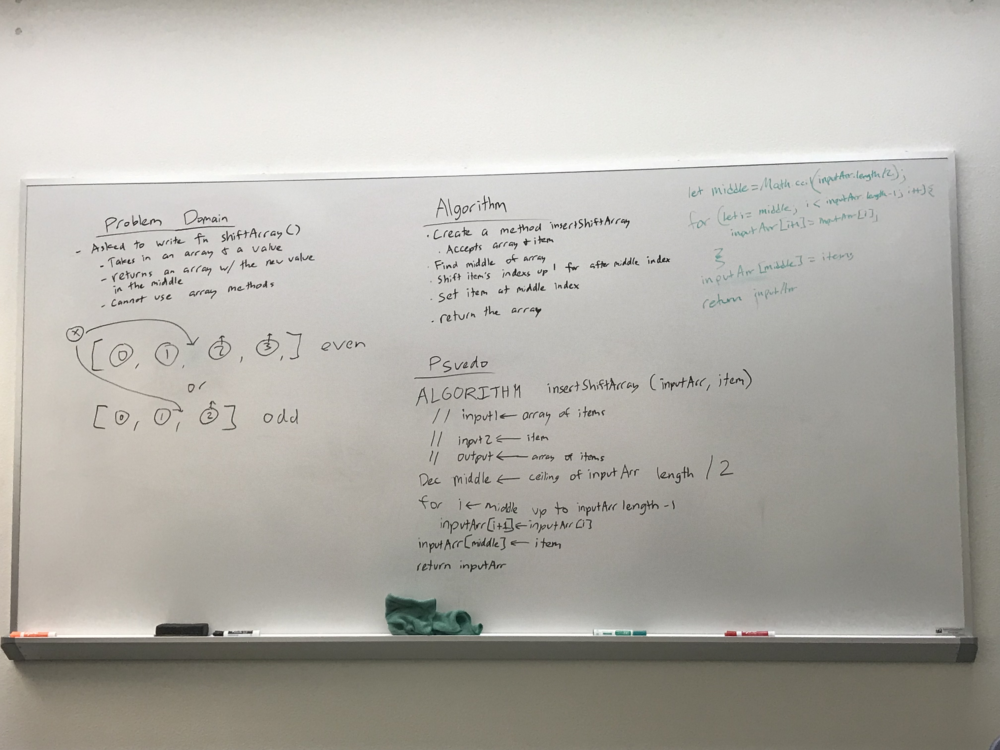
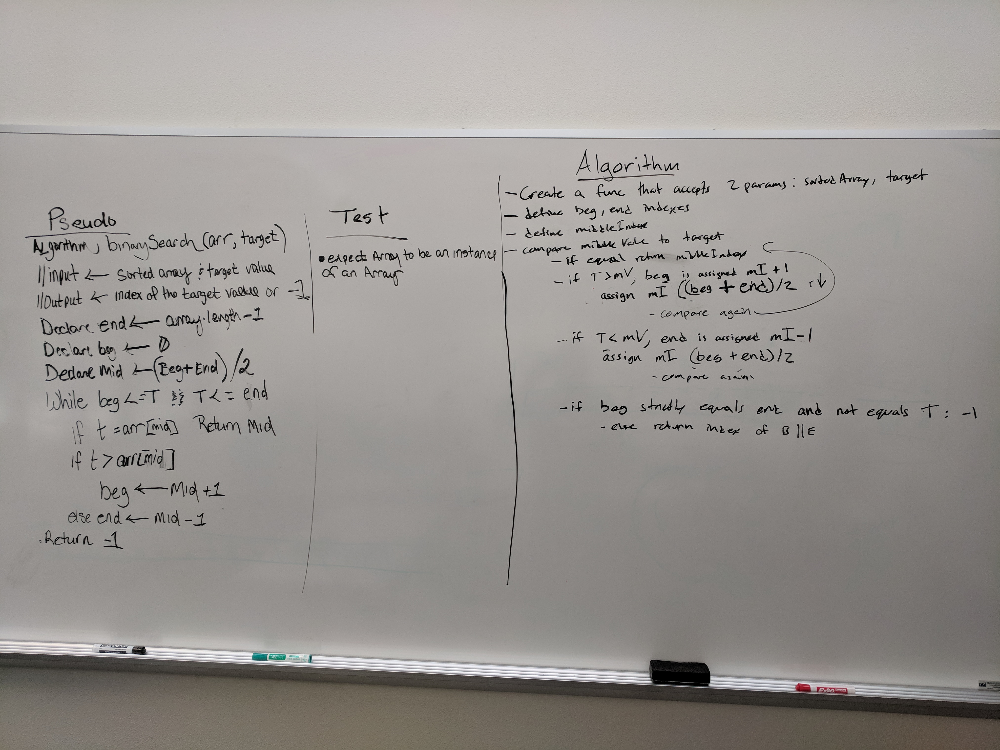
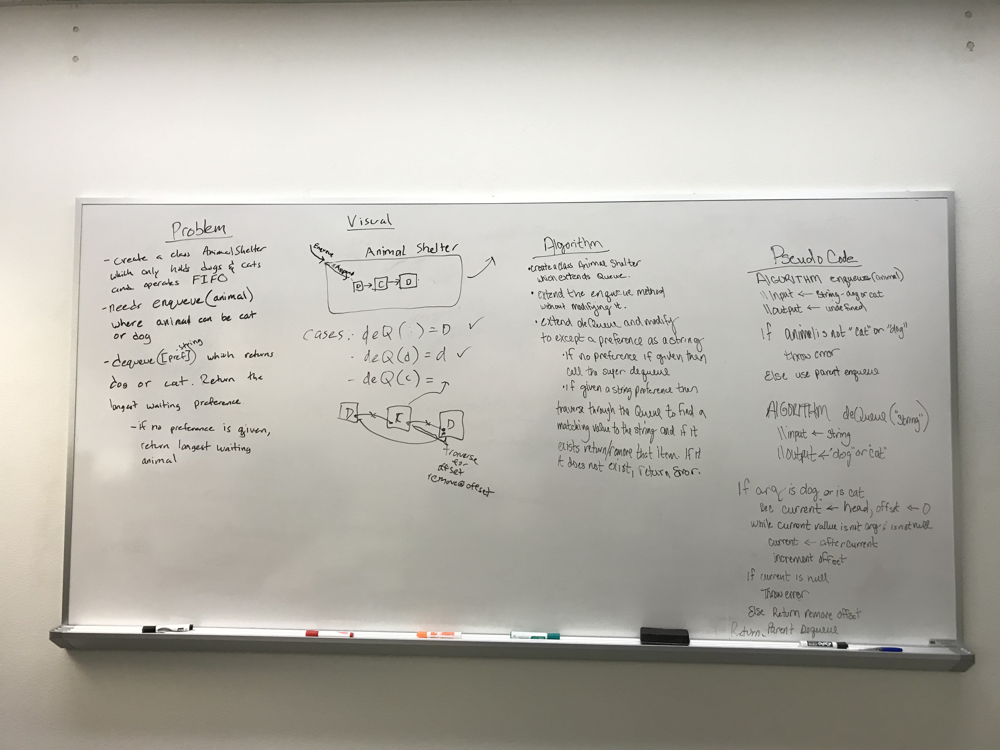
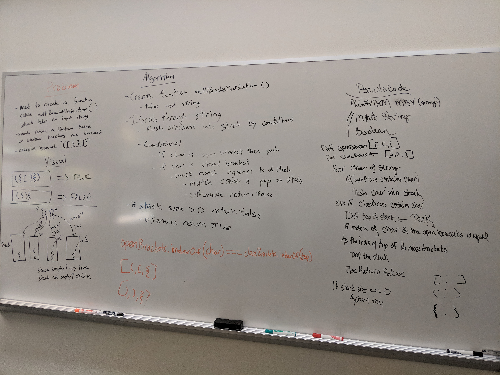
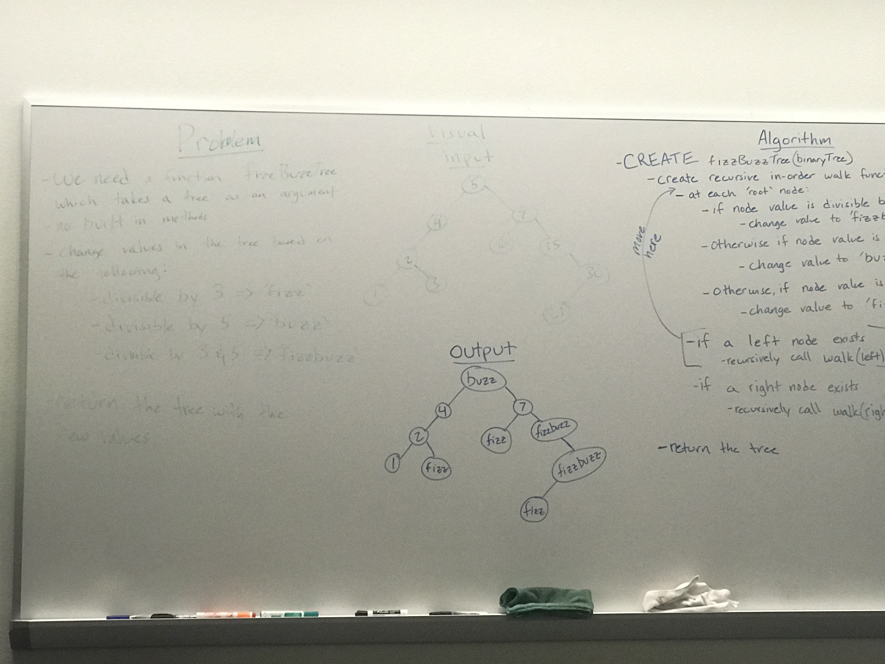

# DATA STRUCTURE CHALLENGES

## Reverse an Array
Take an array and reverse the order of the elements without using built-in methods

#### Challenge
Given an input array, return an array with the elements in reverse order

#### Whiteboard

## Shift an Array from Middle
Insert a value in the middle of an array and shift the indeces.

#### Challenge
Given an input array and an item to insert, return an array where the item has been inserted into the middle of the array (rounding up for odd numbered arrays). The insertShiftArray method is arity of 2.

#### Whiteboard

## Binary Search in Array
Search a sorted array for target value and return its index

#### Challenge
Given a sorted input array and target value to search, return the index of the search value if it is found and if it is not in the array return -1. The binary version of this search utilizes finding the middle of the array and systematically discounting half the values with every operation.  

####Whiteboard

## Stacks with Queues
Create a queue by using stacks

#### Challenge
Make a data structure that is First in first out order (FIFO) with only access to last in first out order (LIFO) data structure. 

#### Solution

## FIFO Animal Shelter
An animal shelter takes in dogs and cats, and gives them to new owners.  If someone asks for a dog or cat they get the cat or dog that has been waiting the longest(First in First out - FIFO).

#### Challenge
The function animalShelter takes an optional input of a preference and returns a cat or dog.  If someone asks for a dog or cat from the animal shelter they get the cat or dog that has been waiting the longest.  If they ask for an animal without a preference they get whatever has been waiting the longest.

#### Whiteboard

## Multi-bracket-validation
Create a function to validate a strings balance for brackets.

#### Challenge
To take a string of whatever size and return true or false if brackets were balanced, meaning each bracket has open and close and can nest within each other while not overlapping.  It is not effected by any non-bracket characters.

Examples:
{} -> true
() -> true
[] -> true
[{}] -> true
[{]} -> false
[true] -> true

#### Whiteboard

## FizzBuzz Tree
Create a function to fizzbuzzify a tree

#### Challenge
Create a function which takes a binary search tree as an input.  It then replaces all nodes in the tree that are multiples of 3 to the string `fizz`, all multiples of 5 as `buzz`, and multiples of both as `fizzbuzz`.

#### Whiteboard

## 11 - Find Maximum Value on Binary Tree
Create a function to find the max value of a binary tree

#### Challenge
Create a function which takes a binary tree as an input.  It then traverses the tree reassigning a max value variable when it encounters a higher value.  After traversal it returns a maximum value for the tree.

#### Whiteboard
