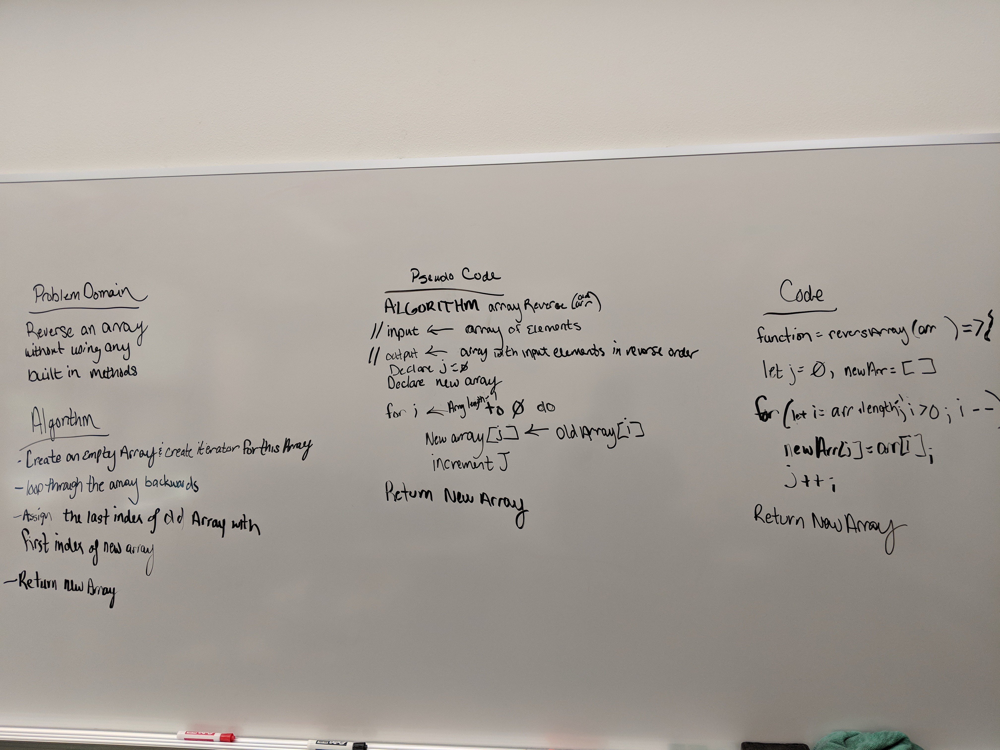

# Data Structures and Algorithms
## 01-Reverse an Array
Take an array and reverse the order of the elements

### Challenge
Given an input array, return an array with the elements in reverse order

### Solution

